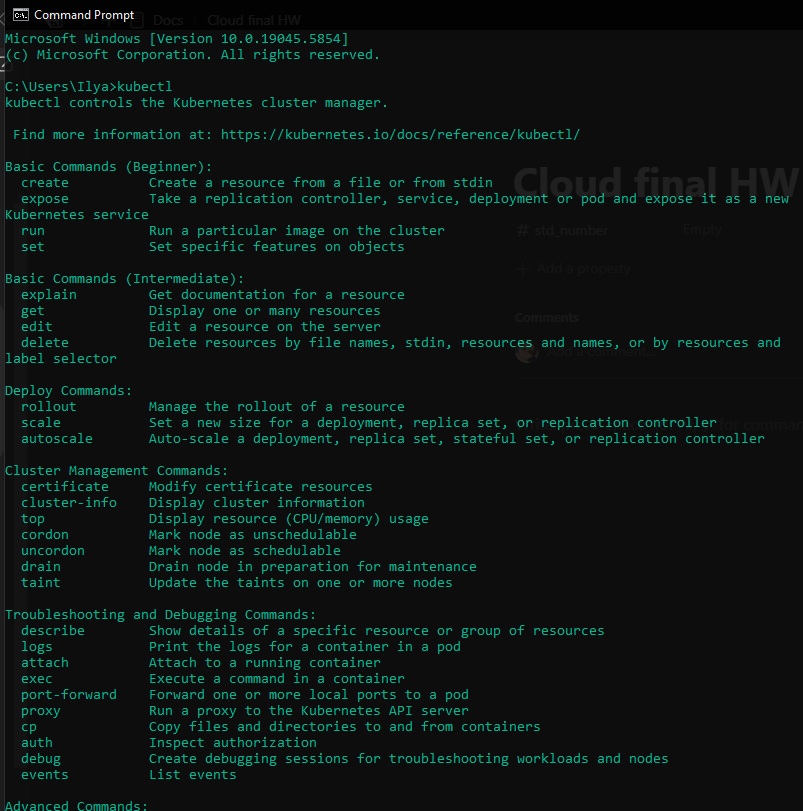

# Cloud final HW

# Abstract

This is a PDF of a notion document for Homework 2 of the Cloud_Computing-Spring-2025 course at Shiraz University located [here](https://github.com/mmRoshani/cloud-computing-2025/tree/main/homeworks/third). 

# Parts 1 & 2

kind installation:




setting up a kind cluster and deploying nginx. 

we use the kubectl command-line tool and below are the .yml/.yaml files

### kind-cluster.yaml

```yaml
kind: Cluster
apiVersion: kind.x-k8s.io/v1alpha4
nodes:
- role: control-plane
  extraPortMappings:
  - containerPort: 80
    hostPort: 8080
    protocol: TCP
  - containerPort: 30080      # <-- add this block
    hostPort: 30080
    protocol: TCP

```

### nginx-deploy.yaml

```yaml
apiVersion: apps/v1
kind: Deployment
metadata:
  name: nginx
spec:
  replicas: 1
  selector:
    matchLabels:
      app: nginx
  template:
    metadata:
      labels:
        app: nginx
    spec:
      containers:
      - name: nginx
        image: nginx:latest
        ports:
        - containerPort: 80

```

### nginx-svc.yaml

```yaml
apiVersion: v1
kind: Service
metadata:
  name: nginx
spec:
  type: NodePort
  selector:
    app: nginx
  ports:
  - port: 80
    targetPort: 80
    nodePort: 30080
```

To expose the application I used the **`nodeport`** method because it seemed to be more straight forward.

After deploying nginx i scaled the deployment to three replicas.


There were some problems so I had to tear everything down and start again. Below is an image of all the commands I used to create a kind cluster, deploy and scale nginx.


To make sure everything is working alright we just go to the exposed port specified in the kind-cluster.yaml files to check if nginx is running. I do this using both a curl command opening [localhost:30080](http://localhost:30080) in my browser.


Up next we use helm to install applications for monitoring the cluster.


After installing them using helm, we forward the ports and then go to port 3000 for graphana and port 9000 for prometheus


And then here is the prometheus dashboard (I took the screenshots after finishing part 4 of the homework)


And finally here is the lens dashboard in the overview tab. The cluster name was `kind-cloud-hw` :


In this homework kind seems to act as a Kubernetes-construction kit that uses **one Docker container per Kubernetes node**.

Inside each of those node-containers lives a second container runtime, and *that* runtime pulls and runs the workload images (Nginx, Prometheus, etc.).

```powershell
┌────────────────────────────────────────────────────────────────────────────┐
│ Windows host (WSL-2 kernel)                                               │
│  └── Docker Desktop daemon                                                │
│      └── Docker container  ➜  kind node     (kindest/node:v1.33.1 image) │
│          • runs kube-apiserver, controller-manager, scheduler, etcd       │
│          • runs containerd                                                │
│             └── Kubernetes Pods ► cgroups/namespaces in the *same kernel* │
│                 • nginx:latest                                            │
│                 • grafana/grafana:10.x                                    │
│                 • quay.io/prometheus/prometheus:2.x                       │
└────────────────────────────────────────────────────────────────────────────┘
```

---

## Layer-by-layer

| Layer | Artifact | Purpose |
| --- | --- | --- |
| **Outer container** | **`kindest/node` image** (~1 GB) | Provides a minimal Linux distro plus all Kubernetes control-plane binaries and containerd. |
| **Inner containers (Pods)** | e.g. `nginx:latest`, `grafana/grafana` | These are the workloads you deploy with `kubectl apply`. |
| **Images “inside images”** | Pulled into `/var/lib/containerd` **inside** the node-container | They’re invisible to the outer Docker daemon; that’s why `docker images` on the host doesn’t show them. |

---

**Bottom line:**

*kind* arranges **containers inside a privileged container** to simulate real Kubernetes nodes, letting you run a full cluster with zero hypervisors or cloud VMs—perfect for local experiments like the homework you just finished.

For monitoring the cluster, we used Helm and Graphana which we installed using helm. Later on, we also used Lens. 

### Helm

Helm is the package manager fgor Kuberneetes. 

- `helm repo add prometheus-community … && helm repo update` – adds chart index.
- `kubectl create namespace monitoring` – isolates the monitoring stack.
- `helm install monitoring prometheus-community/kube-prometheus-stack -n monitoring` – renders ~200 manifests (CRDs, ServiceMonitors, StatefulSets, etc.) and applies them as a **Helm release** called *monitoring*.

**Why Helm is handy:** upgrading or deleting the stack later is a single `helm upgrade` / `helm uninstall` command instead of manually editing hundreds of YAML objects.

### Lens

This seems like a decent tool to monitor the kubernetes cluster. It gives stats and pretty much unifies everything one needs to know about the cluster into an easy to use UI. So instead of just spamming `kubectl` I can just go to the ui and view everything there. like i can enter a `kubectl` command or just go to the workloads>Pods tab and view the available pods and their stats there:


Alright then, that is it for part 1 & 2 of the homework. Moving on…

# Part 3

I used OpenFaaS for the severless platform.

We used the helm package manager for kubernetes to install OpenFaaS. 


As we can see in the above image, after installing OpenFaaS, the platform tells us that we can get the password using the command `echo $(kubectl -n openfaas get secret basic-auth -o jsonpath="{.data.basic-auth-password}" | base64 --decode)` however, that command doesn’t properly work for windows so i got another command that does the job shown in the below image.


Okay so we now have a password that we can use for our admin serverless platform later on.


Finally, we forward the port 8080 from the contrainer to 8081 so that we can access the openfaas UI via our browser.


using the username `admin`  adn the password given to us we login to the UI. We can see there are currently no functions available. So now we have to write a simple function and deploy it on the serverless platform.

we go to the store list to see a bunch of available templates to create a function:

```powershell
faas-cli template store list
```


we choose python3-http template


okay the template creates a directory named reverse which has a sample handler inside and also creates a **stack.yaml file which i renamed to reverse.yml.**

### reverse.yml (stack.yaml)

```yaml
version: 1.0
provider:
  name: openfaas
functions:
  reverse:
    lang: python3-http
    handler: ./reverse
    image: docker.io/itzilya/reverse:latest   
```

here is a simple handler function that just reverse the string in the http request it receives and returns it.

```python
def handle(event, context):
    """
    Receives a string in the HTTP body and returns it reversed.
    """
    return event.body[::-1]

```


the above images show that we deployed the handler. 

We then tested it in the final image by sending a string ( “Hello World”) and say that it returned the reversed string.


We also tested the function using the OpenFaaS UI and saw that it worked.


The above shows the metrics for the control plane inside lens. (I didn’t know what you really wanted to see when you said “check the cluster status in lens” since there a lot of tabs in lens but I just put the images anyway…)

And that is it for part 3. We deployed openfaas on our cluster, uploaded a simple function that reverses a string sent to it via http, and then tested to see if it works

# Part 4

To install ray on the cluster, we use helm:


Okay now we just check to see if we have a ray cluster:


Everything seems to be okay so we checkout the pods:


At the time i took this image, the pods were not ready yet (I think they were still being pulled) so I waited like 15 minutes and then once they were ready, allowed access to port ***8265* (it was in the ray docks)**


Now the following screenshots show the deployment of the ray job. TO my understanding, there are two ray pods working here. One of them is head node and the other one is the worker node. We can see both of them in [the above image](https://www.notion.so/Cloud-final-HW-208fff288ff1803389b1f64cd10dbc52?pvs=21). I followed the official documentation of ray from here: [https://docs.ray.io/en/latest/cluster/kubernetes/getting-started/raycluster-quick-start.html#kuberay-raycluster-quickstart](https://docs.ray.io/en/latest/cluster/kubernetes/getting-started/raycluster-quick-start.html#kuberay-raycluster-quickstart) which in step 4 in that page, it shows how to run an application on a ray cluster. I followed method 2 ([https://docs.ray.io/en/latest/cluster/kubernetes/getting-started/raycluster-quick-start.html#method-2-submit-a-ray-job-to-the-raycluster-using-ray-job-submission-sdk](https://docs.ray.io/en/latest/cluster/kubernetes/getting-started/raycluster-quick-start.html#method-2-submit-a-ray-job-to-the-raycluster-using-ray-job-submission-sdk)**)** which allows us to “Submit a Ray job to the RayCluster using [ray job submission SDK](https://docs.ray.io/en/latest/cluster/running-applications/job-submission/quickstart.html#jobs-quickstart)”.

However, I changed the job to what you said in the homework description to follow an intermediate or advanced example within the ray docs. 

below is the example I chose which is a webcrawler made to run on a ray cluster. I changed the code a bit from the documentation. ( [https://docs.ray.io/en/latest/ray-core/examples/web-crawler.html](https://docs.ray.io/en/latest/ray-core/examples/web-crawler.html))

### /src/test.py

```python
import sys, ray, requests
from bs4 import BeautifulSoup

def extract_links(elements, base_url, max_results=100):
    links = []
    for e in elements:
        url = e["href"]
        if "https://" not in url:
            url = base_url + url
        if base_url in url:
            links.append(url)
    return set(links[:max_results])

def find_links(start_url, base_url, depth=2):
    """Depth-first crawl (sequential)."""
    if depth == 0:
        return set()
    page = requests.get(start_url, timeout=10)
    soup = BeautifulSoup(page.content, "html.parser")
    links = extract_links(soup.find_all("a", href=True), base_url)
    for url in links.copy():
        links |= find_links(url, base_url, depth - 1)
    return links

# ---------------- RAY PART ----------------
@ray.remote
def find_links_task(start_url, base_url, depth=2):
    return find_links(start_url, base_url, depth)

if __name__ == "__main__":
    ray.init(address="auto")

    base = sys.argv[1] if len(sys.argv) > 1 else "https://docs.ray.io/en/latest/"
    # launch 6 crawlers in parallel
    tasks = [find_links_task.remote(f"{base}{suffix}", base)
             for suffix in ["", "", "rllib/index.html", "tune/index.html", "serve/index.html", "data/index.html"]]

    results = ray.get(tasks)
    for idx, links in enumerate(results, 1):
        print(f"Crawler {idx}: {len(links)} links")

```

Now the crawler uses the beautiful soup and the requests library so i had to make sure the dependencies were already installed on the ray pods which are the head node and the worker node (I’m not sure whether it was necessary to install the dependencies on the head node but I did it anyway)


After a whole bunch of bugs and whole bunch of tries I finally got the job running which I tracked the progress through the ray UI as shown below. The job took about 4 minutes and the crawler went to almost a thousand links during that 5 minute period.


```jsx
2025-06-05 13:20:57,739 INFO job_manager.py:530 -- Runtime env is setting up.
2025-06-05 13:20:59,003 INFO worker.py:1514 -- Using address 10.244.0.22:6379 set in the environment variable RAY_ADDRESS
2025-06-05 13:20:59,003 INFO worker.py:1654 -- Connecting to existing Ray cluster at address: 10.244.0.22:6379...
2025-06-05 13:20:59,028 INFO worker.py:1832 -- Connected to Ray cluster. View the dashboard at [1m[32m10.244.0.22:8265 [39m[22m
Crawler 1: 292 links
Crawler 2: 292 links
Crawler 3: 168 links
Crawler 4: 168 links
Crawler 5: 168 links
Crawler 6: 89 links
```

not gonna lie I kinda played it the lazy way and just manually installed the packages in both the head and worker containers instead of creating a “درست درمون” command to install the requirements.txt file before running the script when submitting the job.

I did so by checking the pod names and then using the exec command to install beautiful soup and ray


```powershell
<SNIP>

(.venv-ray) PS C:\Users\Ilya\Desktop\programming\sem6\CLOUDFINALHW> kubectl exec -it raycluster-kuberay-workergroup-worker-fpd5s  -- pip install "beautifulsoup4==4.11.1" "ray>=2.2.0"
Defaulted container "ray-worker" out of: ray-worker, wait-gcs-ready (init)
Collecting beautifulsoup4==4.11.1
  Downloading beautifulsoup4-4.11.1-py3-none-any.whl.metadata (3.5 kB)
Requirement already satisfied: ray>=2.2.0 in ./anaconda3/lib/python3.9/site-packages (2.41.0)
Collecting soupsieve>1.2 (from beautifulsoup4==4.11.1)
  Downloading soupsieve-2.7-py3-none-any.whl.metadata (4.6 kB)
<SNIP>
```

below is the status for the head of the ray cluster for the past 24 hours


and here is when i was running the job (around midnight)


and then the worker:


and that is it… moving on to compare ray and serverless

### Goal

ray is for stateful yet parallel applications that need constant memory access whereas serverless plafrorms such as OpenFaaS are for stateless event driven functions that need to scale up and down fast (in other words they are ephemeral )

### Architecture

Ray is a cluster with 1 head pod and many worker pods. 

the control plane uses gRPC and has a shared object store.

Has its own scheduler.

Serverless platforms usually have short-lived pods where most of the time each pod only runs a single function.

Pods become up and running when a function is called or when an event happens.

### Execution Model

The entire application may be stateful that is why ray has both stateless tasks and stateful actors which can be called via an API. 

in ray, you essentially call the decorated function (ray.remote)  and that fucntion is then distributed and then executed.

if you need a value to proceed, you use ray.get()

In OpenFaaS, you make an HTTP request like we did with curl or opened it in our browser and then that request is handled by a pod.

### Cold starts

Ray is always up, no cold starts and aslo features autoscaling.

openfaas has cold starts which can happen when an image is being pulled.

### Support

ray is a bit more limited in terms of supporting different languages compared to OpenFaaS which we saw had a whole bunch of templates available for a whole bunch of different languages.

When to pick **Ray**

| Choose Ray if … | Example |
| --- | --- |
| You need **in-memory, iterative computation** over large data | Real-time advert bidding model that updates every few seconds using streaming features. |
| The job is **long-running** and latency between subtasks matters | Reinforcement-learning training loop that runs for hours, sharing a policy actor. |
| You want a **Pythonic parallel API** rather than HTTP endpoints | `ray.get([f.remote(x) for x in data])` feels like local `multiprocessing`, scales to a cluster. |

when to pick **OpenFaaS**

| Choose OpenFaaS if … | Example |
| --- | --- |
| Workloads are **bursty, request-/event-driven** | GitHub webhook triggers a lint-and-build function a few times per hour. |
| You need many **tiny, language-agnostic glue pieces** | Data-engineering cron jobs that call different cloud APIs, each under 30 s. |
| **Cold-start penalty is acceptable** and zero cost when idle is attractive | Image-thumbnailer that runs only when a user uploads a picture. |